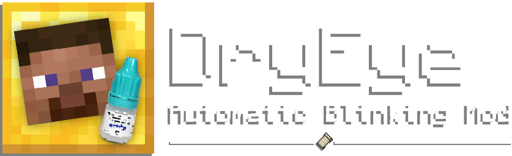
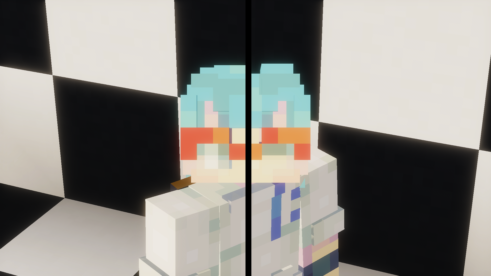
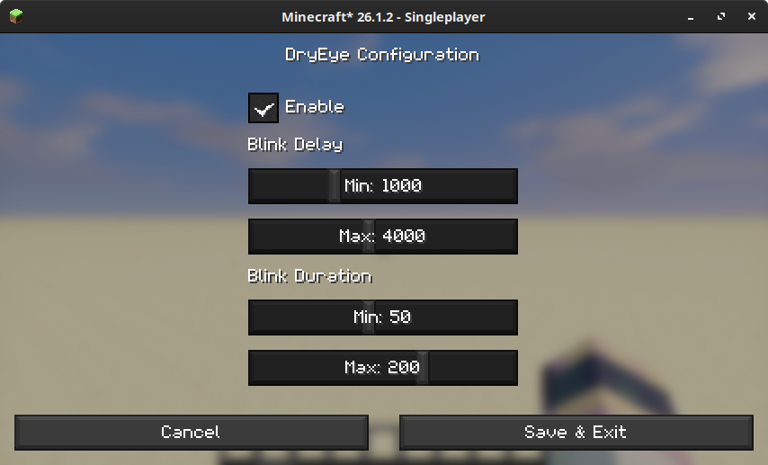
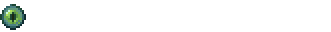
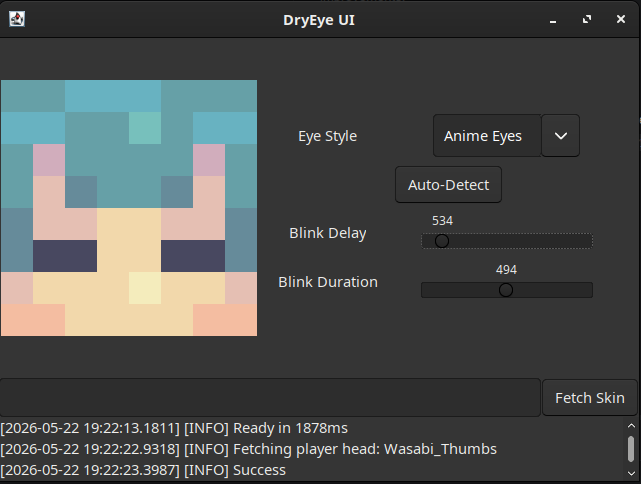

# 

## 
DryEye is a proof-of-concept **Fabric, Forge and NeoForge
mod** that **automatically
modifies player skins so that they can blink
periodically**. It injects a lightweight callback into
the ``AvatarRenderer`` to substitute player skins with a
computed "blink variant" based on complex heuristics. This is
a fuzzy system that won't always work properly, so
[click here](https://github.com/WasabiThumb/dryeye/issues/new/?body=Please+provide+a+detailed+screenshot+here.&labels=eye+schemes)
if you want to report an issue with your skin and improve the mod!



## 
The mod is enabled by default and can be configured
in the ``dryeye.toml`` config file or by clicking through
the [Mod Menu](https://modrinth.com/mod/modmenu) to access the GUI shown below.



## 
The DryEye project also mantains a standalone app
that can be used to debug/play with the skin
modification algorithm. It can be launched
via the ``:app:launch`` Gradle task or by
double clicking the ``dryeye-app-VERSION.jar``
artifact. Downloads can be found
[on GitHub](https://github.com/WasabiThumb/dryeye/releases).



## 
- Allow overriding the computed "eye style" on a per-player basis

## 
```text
Copyright 2026 Xavier Pedraza

Licensed under the Apache License, Version 2.0 (the "License");
you may not use this file except in compliance with the License.
You may obtain a copy of the License at

    http://www.apache.org/licenses/LICENSE-2.0

Unless required by applicable law or agreed to in writing, software
distributed under the License is distributed on an "AS IS" BASIS,
WITHOUT WARRANTIES OR CONDITIONS OF ANY KIND, either express or implied.
See the License for the specific language governing permissions and
limitations under the License.
```

---


